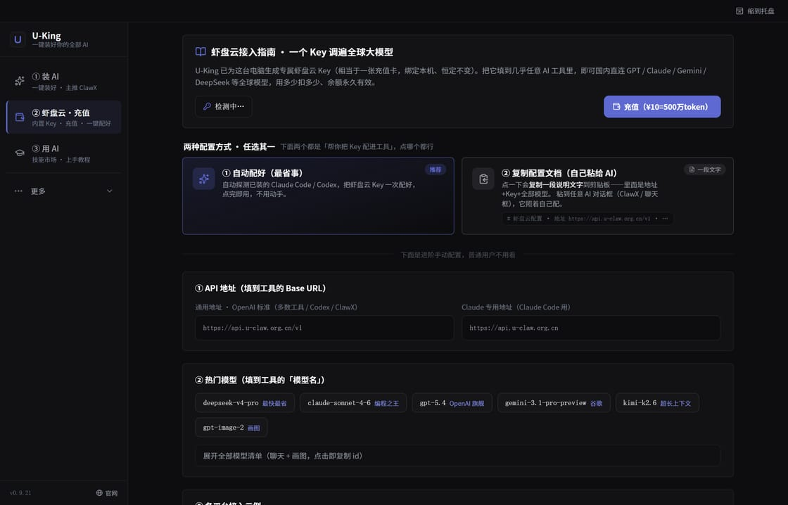

# 📘 Hermes Agent 蓝皮书 · 安装配置入门


> 目标：从没听过 Hermes，到在自己电脑上跑通第一个"会自己干活"的 AI agent。全程不用注册国外账号、不用翻墙。

**最省事的路**：直接下 [U-King 一键装](https://www.u-king.org/?from=hermes)（帮你备好 Python 运行时 + 装好 Hermes + 接好国内算力，跳过下面所有命令）。下面是想自己动手 / U-King 装不上时的完整手册。

---

## 一、Hermes 是什么，能干嘛

Hermes 是 [Nous Research](https://nousresearch.com) 官方开源的 **AI Agent（智能体）框架**。和"在终端写代码"的 Codex、Claude Code 不同，Hermes 的强项是**自己跑多步、长流程的自动化任务**，而且自带一个**网页控制台**（默认端口 `9119`），在浏览器里就能派活、看进度。

装好后你可以让它：

- 「每天早上 8 点抓这几个网站的新内容，整理成一条播报发给我」
- 「有人在我留言箱发消息，就按这套话术自动回复 + 记到表格里」
- 「把『查资料 → 写初稿 → 存档 → 通知我』这一长串步骤，一条指令跑完」
- 「定时巡检一批链接，挂了就告警」

一句话：**Codex / Claude Code 是帮你写代码的程序员，Hermes 是帮你把活自动跑起来的"运营机器人"。** 这也是为什么它适合做获客、留言、定时任务、流程编排这类**自动化变现**的活。

> ⚠️ **为什么 U-King 把它列为"进阶 / 选装"工具？** 因为 Hermes 靠 **Python（pip）** 安装，比"下个 exe 就跑"的工具重——缺 Python、`Scripts` 没进 PATH、依赖装不上都会卡新手。建议**先把 Claude Code / Codex / ClawX 玩顺**，明确需要做自动化时再上 Hermes。不想碰环境的，直接用 U-King 一键装最稳。

---

## 二、安装：U-King 一键装 vs 手动 pip

> 🥇 **最推荐**：用 [U-King](https://www.u-king.org/?from=hermes) 一键装——它帮你把**便携 Python + 国内 pip 源**都配好，`Scripts` 目录自动进 PATH，点一下就装好，下面的坑它全帮你填了。以下是想自己动手的手动方案。

### 方式一（最推荐手动法）：U-King 内置终端里装

在 U-King 左侧栏打开**终端**（已配好便携 Python + 国内 pip 源），逐条复制粘贴回车：

```bash
# 用阿里云 pip 源装 Hermes（包名是 hermes-agent，[web] 带上自带的网页控制台）
python -m pip install -U "hermes-agent[web]" -i https://mirrors.aliyun.com/pypi/simple/

# 验证：能打印版本号就成功了
hermes --version
```

能打印版本号（类似 `hermes x.y.z`）就装好了 ✅，回 U-King 点「重新检测」。

> 💡 **装上了却敲 `hermes` 找不到命令？** 这是 pip 把可执行脚本装进了 Python 的 `Scripts` 目录，而它没进 PATH。U-King 在内置终端里已自动注入；在系统的 CMD 里则用 `python -m hermes` 调用，或把 `...\Python\Scripts` 加进用户 PATH。U-King 装机时也会自动帮你加这个目录。

### 方式二：先装 Python，再用普通命令行装

敲 `python` 提示「不是内部或外部命令」？说明缺 Python，先装它：

- [Python 官网下载](https://www.python.org/downloads/)，或 [国内镜像（npmmirror）](https://registry.npmmirror.com/-/binary/python/)
- 下 **3.10 ~ 3.12** 版（Windows installer）。
- 安装第一屏**务必勾上「Add python.exe to PATH」**，再点 Install。
- **关掉命令行窗口重开**（让 PATH 生效），再回方式一执行。

### 方式三：官方 pip 源（不依赖国内镜像）

国内源偶尔同步滞后缺包时，走官方 PyPI（必要时挂代理）：

```bash
python -m pip install -U "hermes-agent[web]"
hermes --version
```

> 💡 **以上命令里 U-King 一键装已全部内置。** 若你照 seed 安装时某条依赖装不上、或不确定带不带 `[web]`，**以 U-King 一键装好的为准**——它已经验证过整套依赖在国内能装通，别在这一步死磕。

---

## 三、启动网页控制台（端口 9119）

Hermes 自带一个**网页控制台**，跑起来后在浏览器里就能派任务、看 agent 干到哪一步。

- **用 U-King**（推荐）：在「AI 设置 → Hermes」里点**启动**，U-King 会用正确的端口和环境把控制台拉起来，并直接给你打开 `http://127.0.0.1:9119`。**怎么启动以 U-King 一键装为准**，不用自己记命令。
- **想自己拉起来**：装好后控制台默认监听 `9119`，浏览器打开 👇 即可：

```
http://127.0.0.1:9119
```

> 💡 **打不开 / 端口被占？** 9119 被别的程序占了会起不来——见文末「常见报错 TOP5」第 2 条。用 U-King 启动时它会自动避让占用端口。

---

## 四、配模型：让 Hermes 真的能动（不用注册国外账号）



装好 Hermes 只是有了"空壳"，还得给它接一个能用的模型。**国内用户别去折腾国外额度**——下面两条路任选：

### 路线 A（推荐 · 免折腾）：虾盘云内置驱动

U-King 自带的 **虾盘云** 驱动，**开箱即用、国内直连、不用注册任何第三方账号**：

1. U-King「AI 设置 → Hermes」选 **虾盘云**，它用**本机设备 Key** 自动配好，无需手填。
2. 余额不足点「充值」，扫码即到账。**¥1 ≈ 50 万 token**，[充值/查看余额](https://u-claw.org.cn/recharge)。

> 一个 Key 同时供 Hermes、Claude Code、Codex，不用分别注册。

### 路线 B（想用官方/自己的 Key）

Hermes 也能指向任何兼容的 API。常见国产可用模型（都在 U-King「AI 设置」里粘 Key 即可）：

| 平台 | 特点 | 申请页 |
|---|---|---|
| DeepSeek | 国内最便宜、速度快 | [platform.deepseek.com](https://platform.deepseek.com/api_keys) |
| 智谱 GLM | 常有免费额度 | [open.bigmodel.cn](https://open.bigmodel.cn/usercenter/apikeys) |
| Kimi | 超长上下文 | [platform.moonshot.cn](https://platform.moonshot.cn/console/api-keys) |

> 通用四步：注册 → **实名认证（绕不过，先做）** → 创建 Key（`sk-` 开头，多半只显示一次，立刻存好）→ 回 U-King「AI 设置」粘贴。
>
> 想自己手改配置：Windows 上 Hermes 读 `%LOCALAPPDATA%\hermes` 目录（不是 `~/.hermes`），把里面 `config.yaml` 的 model 块 `base_url` / `api_key` 填上你的服务商即可。想省事就直接用路线 A 的虾盘云，让 U-King 自动写。

---

## 五、跑通第一个 agent 任务

模型配好后，打开 Hermes 网页控制台（`http://127.0.0.1:9119`），在输入框用**中文**直接给它派一个**多步小任务**，例如：

> 帮我打开 example.com，把首页上的大标题抓下来，整理成一句话告诉我；做完顺手记一条时间戳。

Hermes 会**列出它打算分几步做**、然后一步步自动执行，控制台里能看到它每一步在干嘛。第一次跑通后，你就有了一个会自己干活的 AI agent——它和聊天机器人的区别是：**它真的动手把流程跑完，而不只是回你一段话。**

进阶玩法（自动化获客、留言机器人、定时播报、接私活搭系统）见 **[📕 红皮书](./红皮书-进阶.md)**。

---

## 六、常见报错 TOP5

<details>
<summary><b>1. 敲 hermes 提示「不是内部或外部命令」 / 找不到命令？</b></summary>

两种可能：
- **缺 Python**：先按「方式二」装 Python（务必勾 Add to PATH），重开命令行。
- **Python 装了，但 `Scripts` 没进 PATH**：pip 把 `hermes` 脚本装在 `...\Python\Scripts`。最稳的办法是在 **U-King 内置终端**里敲（已自动注入），或用 `python -m hermes` 调用；也可手动把那个 `Scripts` 目录加进系统环境变量 PATH。
</details>

<details>
<summary><b>2. 控制台打不开 / 端口 9119 被占用？</b></summary>

说明 9119 被别的程序占了，Hermes 起不来。查谁占了：
```powershell
netstat -ano | findstr 9119
```
关掉占用它的程序，或换个端口启动。**用 U-King 启动会自动避让占用端口**，省心。
</details>

<details>
<summary><b>3. pip 报 SSL / 超时 / 连接错误，依赖装不上？</b></summary>

多半是网络或代理。加国内源重试：
```bash
python -m pip install -U "hermes-agent[web]" -i https://mirrors.aliyun.com/pypi/simple/
```
有 clash / v2ray 代理就临时关掉。还卡就先 `python -m pip install --upgrade pip` 升级 pip 再装。某条依赖在国内实在装不上时，**直接用 U-King 一键装**——它已验证过整套依赖能装通。
</details>

<details>
<summary><b>4. 装好了，U-King 还说没装？</b></summary>

命令行里 `hermes --version` 能打印版本号才算真装好。确认后回 U-King 点「重新检测」；还认不出就**彻底关闭 U-King 再重开**（托盘右键退出 → 双击 U-King.exe）。
</details>

<details>
<summary><b>5. 配置在哪？怎么连虾盘云？</b></summary>

Windows 上 Hermes 读 `%LOCALAPPDATA%\hermes`（不是 `~/.hermes`）。U-King 在「AI 设置 → Hermes」里切驱动会自动写好底层配置；想自己改就编辑那个目录下的 `config.yaml`，把 model 块的 `base_url` / `api_key` 填上你的服务商。**最省事还是用虾盘云让 U-King 自动配。**
</details>

---

<div align="center">

**装好了？继续看 👉 [📕 红皮书 · 进阶实战与变现](./红皮书-进阶.md)**

卡住了扫码加微信，1v1 帮你搞定：


[u-king.org](https://www.u-king.org/?from=hermes) · 谁火装谁，装完教会用

</div>
